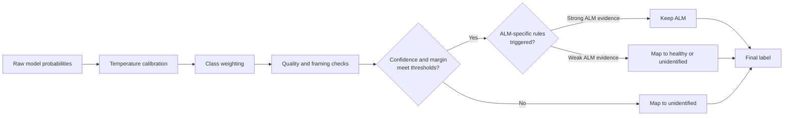

# NailScan Inference Pipeline Diagram

This companion diagram visualizes the diagnosis flow from capture to inference to result rendering.

## High-Level Flow

```mermaid
flowchart TD
  A[app/capture.tsx\nCamera or Gallery Input] --> B[Guide-Based Crop or Manual Crop]
  B --> C[router.push to /processing with imageUri]
  C --> D[app/processing.tsx\nrunTfliteInference(imageUri)]

  D --> E[services/tflite-inference.ts\npreload model if needed]
  E --> F[preprocessNativeImageToRgb]
  F --> G{Native preprocessor\navailable on Android?}

  G -- Yes --> H[Native preprocess\nRGB tensor + quality metadata]
  G -- No --> I[JS fallback preprocess\nresize decode ROI normalize]

  H --> J[Model execution\nNative TFLite runtime]
  I --> J

  J --> K[normalizeOutputValues]
  K --> L[mapToPrediction\ncalibration + guardrails]
  L --> M[TflitePrediction\nlabel confidence index quality flags]

  M --> N[app/processing.tsx\nrouter.replace to /result]
  N --> O[app/result.tsx\nrender diagnosis + debug + save]
```

## Post-Processing Detail (Guardrail Focus)



## File Mapping

- Capture and route handoff: app/capture.tsx
- Inference trigger and redirect: app/processing.tsx
- Core preprocessing, runtime, and guardrails: services/tflite-inference.ts
- Connected model registry: services/tflite-model-assets.ts
- Result rendering and persistence actions: app/result.tsx
